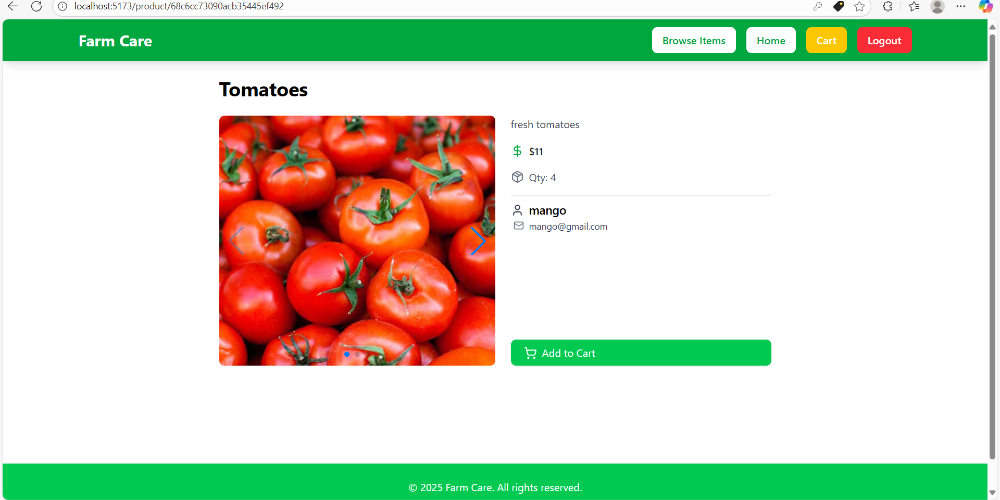
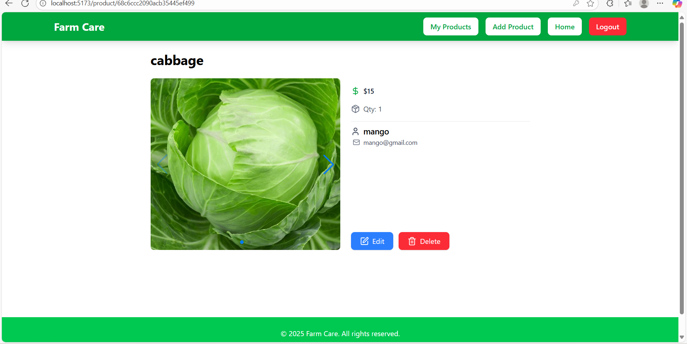
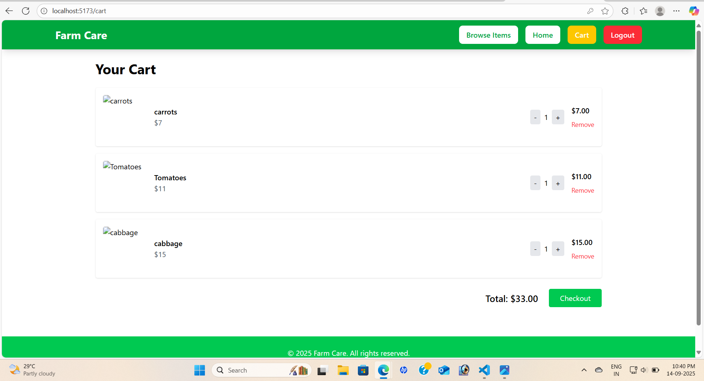

# FARM CARE

**Farm Care** Farm Care is a full-stack web application designed to connect farmers directly with customers, facilitating the seamless listing, browsing, and purchasing of agricultural products. The platform provides role-based access, allowing farmers to manage products and customers to browse, view details, and manage their cart.

This project demonstrates skills in **React**, **Node.js**, **Express**, **MongoDB**, and modern responsive UI design. Perfect for showcasing on a resume as a full-stack development project.

---

#  FEATURES

- **User Authentication**  
  - Customers and farmers can register and log in.  
  - Role-based access control for farmers and customers.  

- **Product Management (Farmer)**  
  - Add, edit, and delete products.  
  - Upload multiple product images.  
  - Manage product quantity and pricing.  

- **Product Browsing (Customer)**  
  - Browse all available products.  
  - View product details including images, description, price, quantity, and farmer info.  
  - Add products to cart with dynamic quantity updates.  

- **Cart Management**  
  - Add/remove items from the cart.  
  - Update quantities.  
  - View total price.  

- **Responsive & Professional UI**  
  - Mobile-friendly and visually appealing design using **Tailwind CSS**.  
  - Interactive product image sliders and icons for enhanced UX.  

---

#  TECH STACK

- **Frontend:** React.js, React Router, Tailwind CSS, Lucide Icons  
- **Backend:** Node.js, Express.js, JWT Authentication  
- **Database:** MongoDB with Mongoose  
- **Tools & Libraries:** Axios, Swiper.js, react-hot-toast, VS Code  

---

# SCREENSHOTS

**Customer View:**  

  

**Farmer View:**  

  


**Cart View:**  

  

---

# INSTALLATION

1. **Clone the repository:**  
```bash
git clone https://github.com/deepthi566/farm-care.git
cd farm-care

2. **Setup Backend**
Navigate to the backend folder
```bash
cd backend
